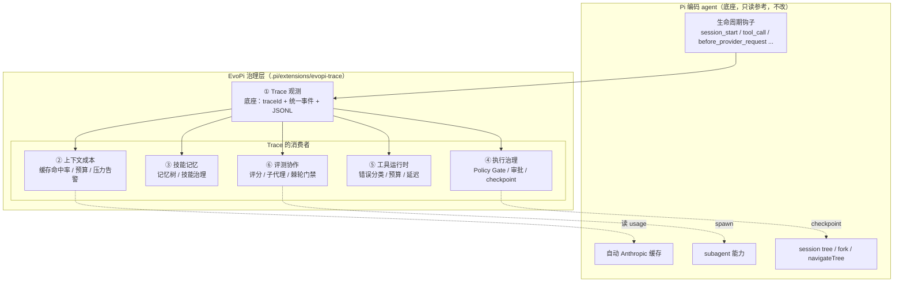

# EvoPi

[](https://github.com/d3f4w2/EvoPi/actions/workflows/ci.yml)
[](tests/)
[](LICENSE)

> **把 Pi 编码 agent 变成一个「会被治理」的工程 agent**：在不改 Pi 内核的前提下，给它套上一圈治理 harness——记成本、管记忆、拦高危、控工具、能评测。全部通过 Pi 的生命周期钩子实现。

**TL;DR (English).** EvoPi wraps the [Pi coding agent](pi/) with a governance layer — cost accounting, skill/memory management, an execution policy gate (it blocks `rm -rf` / force-push / writes to `.env`), tool-runtime error classification & budgets, and deterministic evals — all via Pi's lifecycle hooks, **without patching Pi's core**. 3.2k lines of TypeScript across 10 modules, 49 passing tests, and a real end-to-end run against a live model (Zhipu `glm-4-flash`) that proves the extension loads and emits real provider usage into a trace log.

---

## 30 秒看懂

一句话：**Pi 负责「把活干了」，EvoPi 负责「让这活干得可观测、可管、可信」。**

- 🔴 **执行治理**：每个 `rm -rf` / `git push --force` / `npm publish` / 写 `.env` 都要过 Policy Gate——交互下弹确认，**无人值守（CI）下一律 block**（fail-safe）。变更类操作放行前先打 checkpoint，可回退。
- 💰 **上下文成本**：读 provider usage 算缓存命中率、按 80/90/95% 分档告警上下文压力，成本进 JSONL 可被下游看板消费。
- 🧠 **技能记忆**：三级 scope 记忆 + 关键词检索注入；skill 按 trust 四级过滤（不明来源不自动加载，命中危险强制 blocked）。
- 🔧 **工具运行时**：工具错误 7 类启发式分类 + 延迟统计 + per-turn/per-job 预算（防单轮死循环）。
- 📊 **评测协作**：golden task 确定性打分 + 子代理 spawn + 半自动棘轮门禁（不降级才让升级，人拍板）。
- 🔭 **Trace 底座**：所有模块共用一条统一事件流，双写 JSONL（全量）+ session anchor（仅关键治理决策），**摘要只记形状不记原文**（隐私）。

**想立刻看到它工作** → [demo/](demo/)（真码跑出来的输出，含 `rm -rf` 被拦、命中率被算、真实 usage 落盘）。

---

## 看得见的证据

| 你想确认的事 | 在哪看 |
| --- | --- |
| 「它真拦得住 `rm -rf` 吗？」 | [demo/ Demo 1](demo/README.md#demo-1--执行治理它真的拦得住-rm--rf)——真码跑出的风险判定表 |
| 「测试怎么跑？真能跑吗？」 | `npm install && npm test` → **49 断言全过**；说明见 [tests/](tests/) |
| 「它真在 Pi 里跑起来过吗？」 | [端到端验证](docs/evopi-v1/impl/e2e-验证/)——真跑 `glm-4-flash`，扩展真实产出 9 条事件 + 真实 provider usage |
| 「代码长什么样？」 | [.pi/extensions/evopi-trace/](.pi/extensions/evopi-trace/)（10 个 .ts，~3.2k 行，strict tsc 0 错） |
| 「架构怎么想的？踩过什么坑？」 | [设计文档](docs/evopi-v1/) + [面试叙事](docs/evopi-v1/面试叙事.md) |

---

## 架构一图

**EvoPi = Pi 编码 agent（底座，只读不改）+ 一圈治理扩展（`.pi/extensions/`）。** Trace 是底座，其余五个模块都是它的消费者：



> 关键取舍：执行治理（安全）与工具运行时（资源）**共用同一个 `tool_call` handler**，安全决策先跑——「安全 > 资源」。完整时序图与事件总线见 [00-整体架构.md](docs/evopi-v1/00-整体架构.md)。

---

## 快速上手

### 只想跑测试 / 看 demo（30 秒，无需模型、无需联网）

```bash
git clone https://github.com/d3f4w2/EvoPi.git
cd EvoPi

# 一条命令从零复现（装依赖 → 49 断言 → 两个 demo，全程无需密钥/联网）
node scripts/reproduce.mjs

# 或手动分步：
npm install                        # 只装一个 devDependency：tsx
npm test                           # 49 断言，跑真实模块
npx tsx demo/demo-guardrail.mts    # 看它怎么拦高危
npx tsx demo/demo-cost.mts         # 看它怎么算成本
```

### 想在真实 Pi 里跑（端到端）

EvoPi 是 Pi 的**项目级扩展**（`.pi/extensions/evopi-trace/`）。跑通端到端需要 Pi 参考仓 + 一个模型网关，三条硬约束（都被源码验证过）见 [端到端验证 README](docs/evopi-v1/impl/e2e-验证/README.md)：

1. Pi 参考仓要 `npm install`（需要 `jiti` 扩展加载器 + `tsx`）；
2. 非交互模式必须 `--approve`（否则项目信任默认 false，扩展会被跳过）；
3. 非 TTY 下 prompt 必须走 stdin 管道（否则等 EOF 死锁）。

一键跑端到端：`node scripts/reproduce.mjs --e2e`（需先设置 `ZHIPU_API_KEY` 且 `pi/` 已 `npm install`；缺任一会优雅跳过并说明怎么补）。脚本见 [scripts/reproduce.mjs](scripts/reproduce.mjs)，底层委托 [run-e2e.ps1](docs/evopi-v1/impl/e2e-验证/run-e2e.ps1)。

---

## 仓库结构

```text
EvoPi/
├── README.md                      # 你在这
├── LICENSE                        # MIT
├── package.json                   # npm test / npm run typecheck
├── tests/                         # 49 断言，直接 import 真实扩展模块（见 tests/README.md）
├── demo/                          # 真码驱动的可视化 demo（见 demo/README.md）
├── scripts/                       # typecheck / 一键复现
├── .github/workflows/ci.yml       # CI：npm test
├── .pi/extensions/evopi-trace/    # ★ EvoPi 扩展本体（10 个 .ts，见其 README）
│   ├── index.ts                   #   入口：注册 + 单一 tool_call 路由（安全>资源）
│   ├── trace.ts                   #   ① 底座：traceId / 事件 / JSONL / anchor 判定
│   ├── cost.ts                    #   ② 上下文成本
│   ├── policy.ts                  #   3/4/5 共享：危险黑名单 + 受保护路径（单一事实源）
│   ├── memory.ts / skill.ts       #   ③ 技能记忆
│   ├── job.ts                     #   ④ 执行治理 · Policy Gate
│   ├── tools.ts                   #   ⑤ 工具运行时
│   └── eval.ts / subagent.ts      #   ⑥ 评测协作
├── docs/evopi-v1/                 # 设计文档（7 模块 + 整体架构 + 面试叙事）
└── pi/                            # Pi 编码 agent 参考仓（只读；已 gitignore 其 node_modules）
```

---

## 项目状态与边界（诚实标注）

- ✅ **V1 六模块全部实现**（成本 / 记忆 / 执行治理 / 工具运行时 / 评测），strict tsc 0 错，49 测试全过。
- ✅ **端到端跑通**：真 Pi + 真模型，扩展真实加载、生命周期事件 + `cost.request`（真实 usage）落盘。
- ⬜ **已知边界**：`tool.call` / `policy.*` / `compact.*` 等事件的**真 Pi 触发**尚未全部录取（逻辑与写盘路径已被离线测试覆盖）；默认 policy 的 `curl … | sh` 是字面子串匹配、带 URL 时会漏判（见 [tests/policy.test.ts](tests/policy.test.ts) 里那条诚实断言，待 V2 收紧为正则）；工具级超时（AbortController）因 Pi API 限制留 V2。
- 📌 这是一个**学习 + 作品**性质的项目：目标是把「治理型 agent」这件事从设计一路做到可跑、可测、可演示，并把过程中的真实取舍记录下来。

## License

[MIT](LICENSE)
