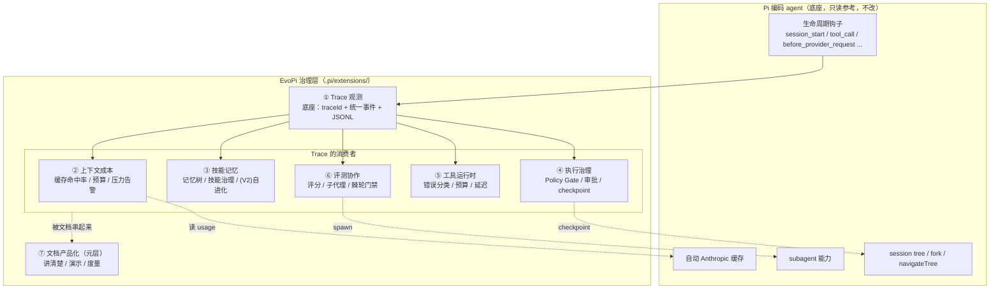
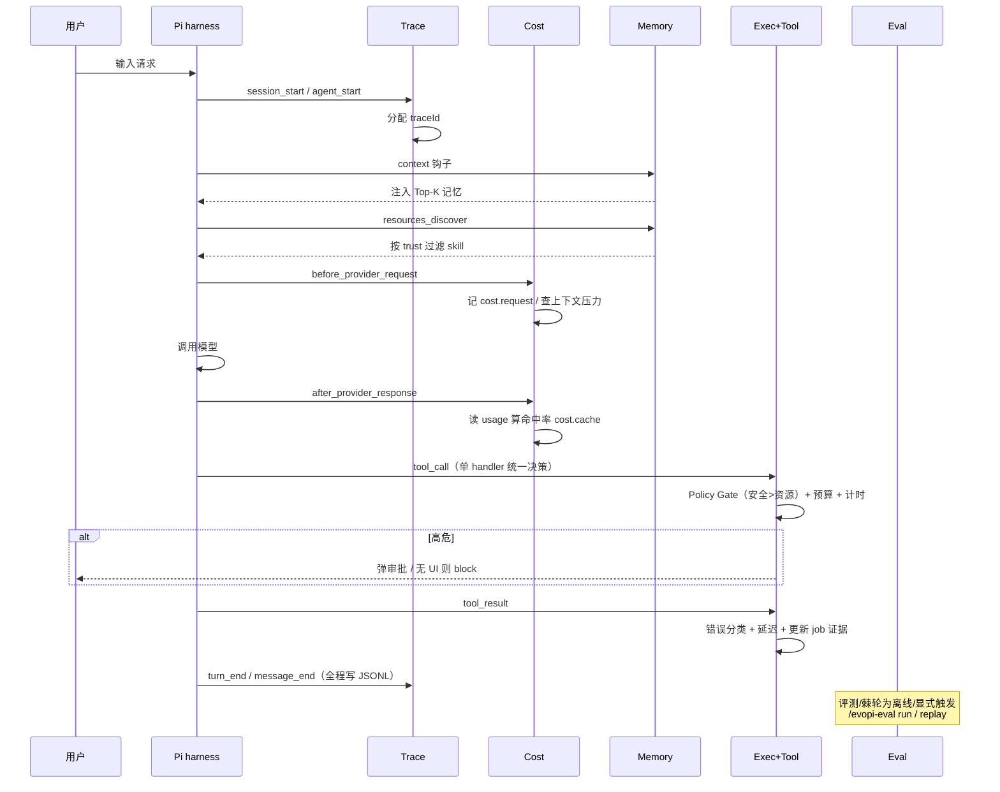
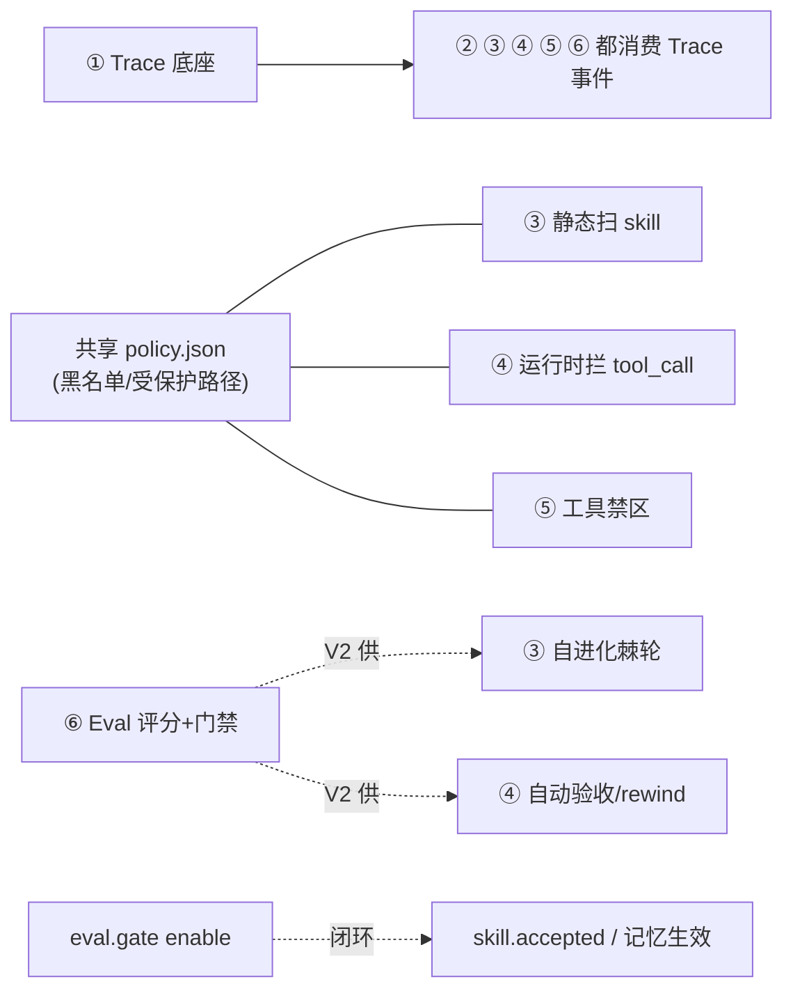
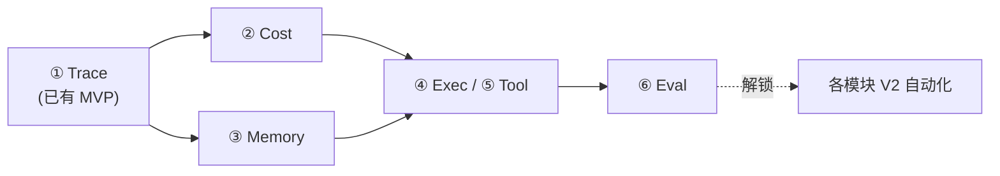

# 00 EvoPi 整体架构

> 站在高处看 EvoPi：七个模块怎么组成一个整体、数据怎么流、一次运行如何串起来。
> 各模块细节见对应文档；进度见 [进度.md](进度.md)；总览见 [README.md](README.md)。
> 本文档在 7 个模块决策全部完成后绘制（遵循「图只在行为决策完成后加」）。

## 一、一句话架构

EvoPi = **Pi 编码 agent（底座）** + **一圈治理 harness（EvoPi 扩展）**。不改 Pi core，全部通过 Pi 的生命周期钩子实现。其中 **Trace 是底座，其余五个模块都是它的消费者**，文档产品化是元层。

## 二、分层架构



**读法**：Pi 提供钩子和现成能力（缓存/子代理/session tree）；Trace 把钩子归一成统一事件流做底座；五个消费者各自订阅、加自己的治理逻辑；文档产品化把它们串成对外可讲的整体。

## 三、一次 agent 运行的时序（各模块何时介入）



**关键点**：记忆注入在请求前、Cost 观测夹在 provider 前后、执行治理+工具运行时**共用同一个 tool_call**（安全 > 资源）、Trace 全程记录、Eval 是离线/显式触发（不在主循环里）。

## 四、事件总线全景

所有模块的事件都是 Trace 的 `EvoPiTraceEvent` 扩展，双写 **JSONL**（全部）+ **session anchor**（仅关键）。

| 模块 | 事件 | 写 session anchor？ |
| --- | --- | --- |
| Trace | `session.start`/`turn.*`/`provider.*`/`tool.call`/`tool.result`/`message.end`/`compact.*`/`session.shutdown` | 部分（session/compact） |
| Cost | `cost.request`/`cost.cache`/`cost.pressure` | ❌ 全 JSONL |
| Memory | `memory.write`/`memory.review`/`memory.retrieve` | ✅ 仅 write（显式）/ ❌ 其余 |
| Skill | `skill.invoke`/`skill.outcome`/`skill.approved`/`skill.blocked`/`skill.filtered` | ✅ 仅 approved / ❌ 其余 |
| Exec | `job.*`/`job.checkpoint`/`job.rewind`/`policy.check`/`policy.blocked`/`policy.approved`/`policy.denied` | ✅ 审批+checkpoint+job 终态 / ❌ policy.check |
| Tool | `tool.result`(扩展 errorClass/latency) / `tool.budget` | ✅ 仅 budget 硬限 / ❌ 其余 |
| Eval | `eval.score`/`eval.run`/`eval.replay`/`eval.gate`/`eval.candidate` | ✅ gate+candidate / ❌ 评测过程 |

**统一判据（跨模块）**：**资产的产生/审批/关键治理决策 → 写 session anchor；逐次观测/执行细节 → 只进 JSONL。** 客观执行属性（如 errorClass/latency）可加进 Trace core 事件，消费者语义视角才独立成事件。

## 五、数据与存储布局

```text
.pi/extensions/evopi-trace/index.ts   # V1 所有模块共存于此扩展（后续拆分）
.pi/evopi/
  traces/<traceId>.jsonl              # 完整 trace（含所有模块 *.* 事件）
  memory/                             # 模块3：project scope（user 在 ~/.evopi/memory/）
    INDEX.md / MEMORY.md / SKILLS.md
  skills/<name>/SKILL.md              # 模块3：Pi 格式 + EvoPi 治理 frontmatter(trust...)
  agents/<name>.md                    # 模块6：agent card（Pi frontmatter + maxTurns/outputSchema）
  evals/
    tasks/*.yaml                      # 模块6：golden task
    runs.jsonl                        # 模块6：eval 记录
  policy.json                         # 模块3/4/5 共享：危险动作黑名单 + 受保护路径
```

**session tree**：只写 anchor（traceId/summary/checkpoint/资产审批），不全量双写。
**SQLite**：全模块暂缓，跟 Trace 走（词表稳定后统一加）。

## 六、模块协作关系（谁依赖谁、共享什么）



**三个关键协作**：
1. **共享 policy 定义**：模块 3（静态扫 skill 文本）/ 4（运行时拦 tool_call）/ 5（工具禁区）读同一份 `policy.json`，两道防线不漂移。
2. **tool_call 单 handler**：模块 4（安全准入）+ 模块 5（可靠性预算）共用一个 tool_call handler，**安全 > 资源**，避免多 handler 顺序陷阱。
3. **Eval 是自动化的裁决引擎**：模块 3 的自进化、模块 4 的自动验收/rewind（都是 V2）都依赖模块 6 提供评分+门禁；`eval.gate` enable 闭环 `skill.accepted`。

## 七、实现依赖顺序



1. **① Trace 先行**——所有模块需要它的事件流（已有 MVP）。
2. **② Cost 次之**——最快出可量化产出（命中率/成本），验证 Trace 词表。
3. **③ Memory** 在 trace/cost 后——技能路由可测、记忆写入可审。
4. **④ Exec / ⑤ Tool** 在策略/trace 词表稳定后——共享 policy、共用 tool_call。
5. **⑥ Eval 最后**——门禁可复用 trace/skill 统计/job 记录；做完解锁各模块 V2 自动化。

## 八、贯穿全局的四条设计哲学

1. **先摸底座再设计**：每模块先查 Pi 源码，只补缺口，不重复造轮子（Pi 已做缓存/子代理/tool block/session tree，EvoPi 不重造）。
2. **V1 观测/基础，V2 自动化**：Cost 先观测、记忆先候选、验收先摆证据、rewind 先手动、棘轮先半自动——证据充分才放开自动决策。
3. **保守默认守底线**：总是拦高危、无 UI fail-safe、评分不猜、人在环。
4. **从 Trace 沉淀资产 + 证据链**：失败变 golden task、审批写 session、eval.gate 闭环 skill.accepted——一切可追溯、可重建。

## 九、V1 → V2 → V3 整体演进

| 阶段 | 主题 | 各模块 |
| --- | --- | --- |
| **V1** | 观测 + 基础治理 + 半自动 | Trace 事件底座 / Cost 观测 / 记忆+技能治理 / Policy Gate / 工具可靠性 / 评分+棘轮半自动 |
| **V2** | 自动化 | Cost 主动缓存策略 / 技能自进化棘轮 / 执行自动 rewind+验收 / MCP+沙箱 / Eval 全自动门禁+多评估器 |
| **V3** | 规模化 + 产品化 | 跨项目资产 / 远程沙箱+凭据金库 / CI 集成 / 度量看板 / 对外发布 |

**一句话**：V1 让 agent 的每一步「看得见、可控」，V2 让它「自己会优化」，V3 让它「能规模化交付」。
